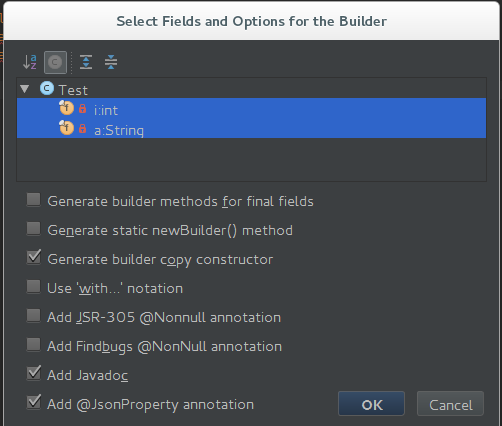

innerbuilder
============

[IntelliJ IDEA](http://www.jetbrains.com/idea/) plugin that adds a 'Builder' action to the Generate menu (Alt+Insert)
which generates an inner builder class as described in Effective Java. Works with IntelliJ IDEA 12.x, 13.x and 14.x.

This project is a customization from https://github.com/analytically/innerbuilder.



```java
public class Test {
    private final int i;
    private final String a;

    private Test(final Builder builder) {
        this.i = builder.i;
        this.a = builder.a;
    }


    /**
     * {@code Test} builder static inner class.
     */
    @JsonIgnoreProperties(ignoreUnknown = true)
    public static final class Builder {
        private int i;
        private String a;

        /**
         * Default Constructor
         */
        public Builder() {
        }

        /**
         * Clone Constructor, for clone an existing {@code Test}.
         *
         * @param copy the copy to clone.
         */
        public Builder(final Test copy) {
            this.i = copy.i;
            this.a = copy.a;
        }

        /**
         * Sets the {@code i} and returns a reference to this Builder so that the methods can be chained together.
         *
         * @param i the {@code i} to set
         * @return a reference to this Builder
         */
        @JsonProperty
        public Builder i(final int i) {
            this.i = i;
            return this;
        }

        /**
         * Sets the {@code a} and returns a reference to this Builder so that the methods can be chained together.
         *
         * @param a the {@code a} to set
         * @return a reference to this Builder
         */
        @JsonProperty
        public Builder a(final String a) {
            this.a = a;
            return this;
        }

        /**
         * Returns a {@code Test} built from the parameters previously set.
         *
         * @return a {@code Test} built with parameters of this {@code Test.Builder}
         */
        public Test build() {
            return new Test(this);
        }
    }
}
```

### Installation

Download the plugin jar `innerbuilder.jar`.
In IntelliJ IDEA 12.x or later, go to `File > Settings > Plugins`. Select "Install Plugin From Disk" in IntelliJ's plugin preferences.

### Usage

Use `Shift+Alt+B` or `Alt+Insert` and select `Builder...`. Choose the fields to be included and press `OK`. When generating a
builder when a builder already exists, the plugin will try to update it. It will add missing fields and builder methods, but
never remove any fields or methods.

### Customization
1. Support final fields in setter method.
2. Add `@JsonProperty` and `@JsonIgnoreProperties(ignoreUnknown = true)` for builder.
3. Add javadoc for bulder constructors.
4. Add `final` keyword in method parameters.

### Building

Building has problems.... some urls are out of date.

### License

Licensed under the [Apache License, Version 2.0](http://www.apache.org/licenses/LICENSE-2.0).

Copyright 2013-2015 [Mathias Bogaert](mailto:mathias.bogaert@gmail.com).
